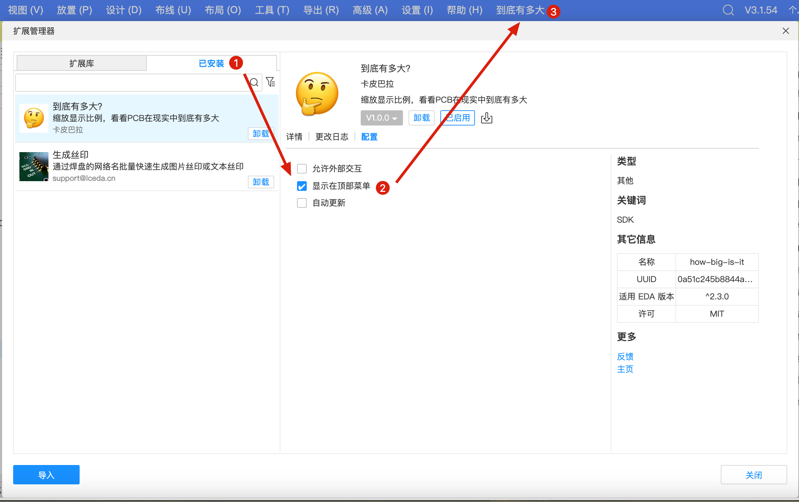
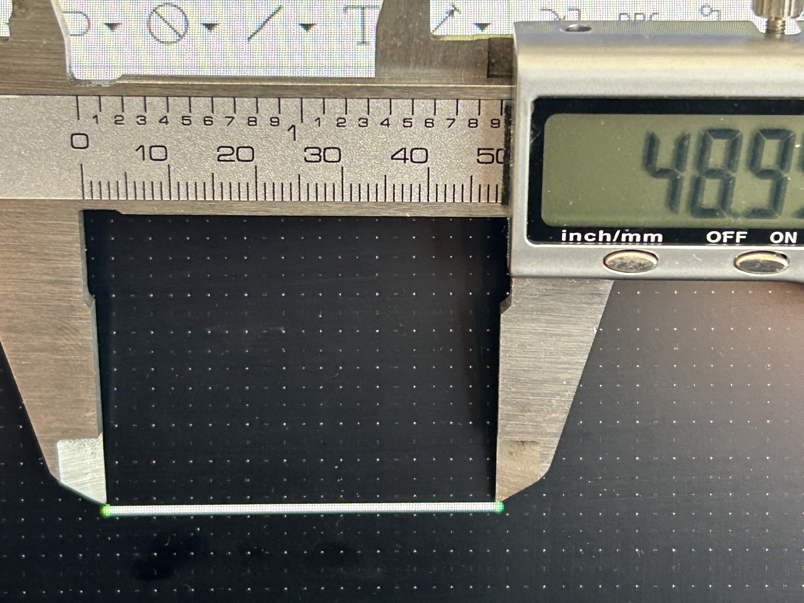
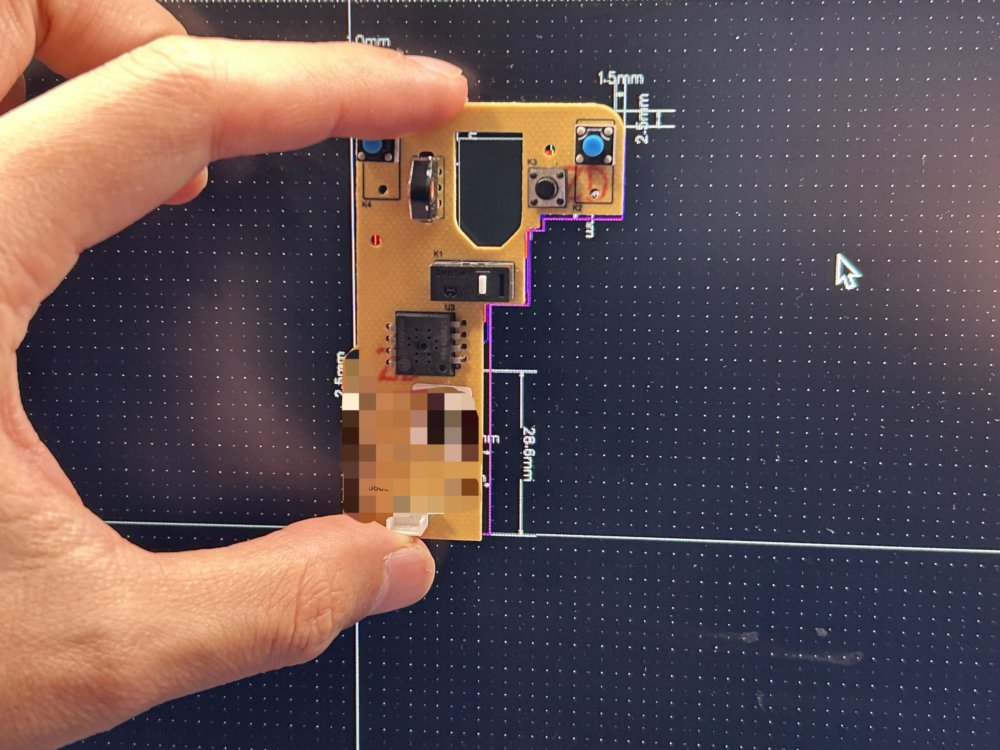

# 🤔到底有多大？

## 前言

一个用于把 PCB 在屏幕上的长度精确映射为现实尺寸的小工具。通过在屏幕上标定一段已知长度的线段，计算并应用缩放系数，从而可以以真实尺寸预览。只需对一个显示器测量一次即可保存校准数据，支持暗色模式，界面简洁、轻量并且离线运行。

## 用法

1. 安装插件，勾选配置中的“显示在顶部菜单”，并打开插件

2. 点击步骤一的按钮，在PCB上放置一个线段，如果在显示器上过长或过短，可以对参数进行相应的调整

3. 量出线段在你的显示器上的实际长度

4. 将量出的实际长度填入输入框

5. 点击执行缩放

6. Enjoy

## 其他

- 如果遇到BUG， 先尝试重置一下，如果仍不能解决，请评论并尽量完整地描述问题，有空会修复
- 代码以 Apache-2.0 协议开源，随意使用无需询问，源代码请查阅 [GitHub](https://github.com/eext-kap1bala/howBigIsIt)
- 大部分样式代码由 Copilot 生成，感谢它把我从重复劳动中解放出来
